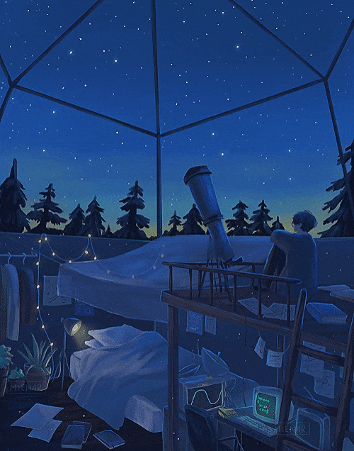

<!-- Header -->

<!-- Header icons -->

<!-- Introduction image -->
  <picture>
    <source media="(prefers-color-scheme: light)" srcset="https://camo.githubusercontent.com/5ddf73ad3a205111cf8c686f687fc216c2946a75005718c8da5b837ad9de78c9/68747470733a2f2f7468756d62732e6766796361742e636f6d2f4576696c4e657874446576696c666973682d736d616c6c2e676966" align="right" width="44%">
    
  </picture>
  <!--  -->

<!-- Programming languages -->
<h2>I've worked with</h2>

		 

  

<!-- Profile summary -->
<h2 align="left">Profile summary </h2>

  <picture>
    <source srcset="https://github-readme-stats.vercel.app/api?username=Anant-mishra1729&show_icons=true" media="(prefers-color-scheme: light)" width="47%" />
    
  </picture>
  <picture>
    <source media="(prefers-color-scheme: light)" srcset= "https://github-readme-streak-stats.herokuapp.com?user=Anant-mishra1729&theme=default" width="50%">
    
  </picture>

<!-- Diary -->

<h3 align="left">Behold, a glimpse into the universe from my diary ... </h3>

>"The starlight we see each night is a window to the past  a glimpse of the forgotten universe...  It holds within the secrets of creation, a tale etched into the very fabric of cosmos   frozen in time, waiting to be uncovered..." 

<b>I've pinned a few projects below, hope you like them... </b>
  <!-- Footer -->

  

