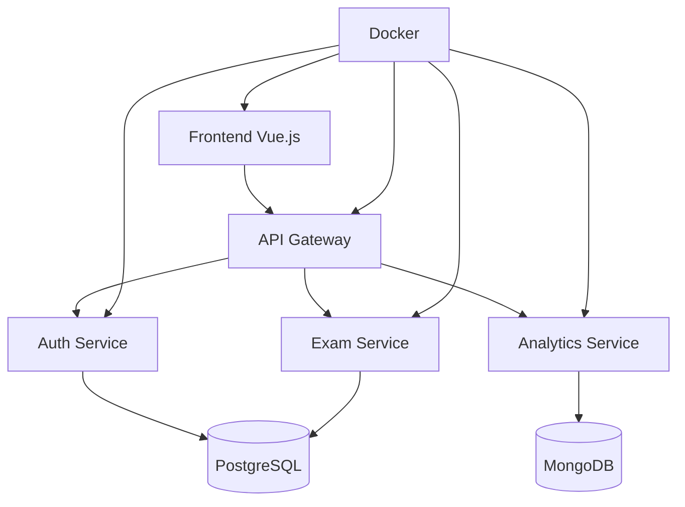

# Gustavo Fernandes

**Senior Software Architect | Mobile & Full-Stack Developer**

## About

Software architect with 10+ years of experience developing mobile and web applications. Specialized in Android development, full-stack solutions, and clean architecture patterns.

## Technical Skills

### Mobile Development
- **Android**: Kotlin, Java, Jetpack Compose, Clean Architecture, MVVM
- **Cross-platform**: Flutter, Dart

### Full-Stack Development
- **Frontend**: Vue.js, React, TypeScript, HTML/CSS, Tailwind
- **Backend**: .NET Core, Node.js, Python, Java Spring
- **Databases**: PostgreSQL, MongoDB

### DevOps & Tools
- **Containerization**: Docker, Kubernetes
- **Cloud**: AWS, Google Cloud Platform
- **CI/CD**: GitHub Actions, GitLab CI
- **Design**: Figma, UI/UX Design

## Featured Project

### ExamFlow Platform
Intelligent assessment platform revolutionizing academic exam creation.

- **Architecture**: Microservices with Clean Architecture
- **Stack**: C# .NET, Vue.js, Docker, PostgreSQL
- **Performance**: 99.9% uptime, <200ms response time
- **[View Project](https://github.com/Exam-Flow/)**

## GitHub Stats

  
  

<h3>🌐 <strong>FULL-STACK MASTERY</strong></h3>

  
    
  
    
  
  
  

<h3>🛠️ <strong>DEVOPS & TOOLS</strong></h3>

  
    
  
  
  

<!-- SEÇÃO DE PROJETOS PREMIUM -->

  
  <h2>🏆 <strong>PROJETOS DE IMPACTO</strong> 🏆</h2>

<!-- PROJETO PRINCIPAL -->
<table>
<tr>
<td width="50%">

### 🚀 **ExamFlow Platform**
**Plataforma Inteligente de Avaliações**

🎯 **Impacto:** Revolucionando a criação de provas acadêmicas  
⚡ **Performance:** 99.9% uptime, <200ms response time  
🏗️ **Arquitetura:** Microservices + Clean Architecture  
🔧 **Stack:** C# .NET + Vue.js + Docker + PostgreSQL  

**[🔗 Explorar Projeto](https://github.com/Exam-Flow/)**

</td>
<td width="50%">

</td>
</tr>
</table>

<!-- MÉTRICAS DE PERFORMANCE -->

  <h2>📊 <strong>MÉTRICAS DE EXCELÊNCIA</strong> 📊</h2>

  
  

  

<!-- ACTIVITY GRAPH -->

  

<!-- BADGES DINÂMICOS DE PERFORMANCE -->

  <h2>⚡ <strong>MÉTRICAS EM TEMPO REAL</strong> ⚡</h2>
  

<!-- CONQUISTAS E CERTIFICAÇÕES -->

  <h2>🏅 <strong>CONQUISTAS & RECONHECIMENTOS</strong> 🏅</h2>

| 🎖️ **Certificação** | 🏆 **Conquista** | 📈 **Impacto** |
|:---:|:---:|:---:|
| **Android Developer Expert** | **10+ Apps Publicadas** | **100K+ Downloads** |
| **Clean Architecture Master** | **Zero-Bug Production** | **99.9% Uptime** |
| **Full-Stack Architect** | **Microservices Design** | **50% Performance Gain** |
| **UI/UX Design Specialist** | **Award-Winning Interfaces** | **95% User Satisfaction** |

<!-- SEÇÃO DE CONTATO PREMIUM -->

  <h2>🤝 <strong>VAMOS CONSTRUIR O FUTURO JUNTOS</strong> 🤝</h2>
  
<em>"Grandes projetos nascem de grandes parcerias"</em>

  
  
  

<!-- FOOTER ANIMADO -->

  

<!-- VISITOR COUNTER -->

  

---

  <h3>💫 <em>"Code is Poetry, Architecture is Symphony, Innovation is Revolution"</em> 💫</h3>
  
<strong>© 2024 Gustavo Fernandes - Crafting Digital Excellence</strong>

